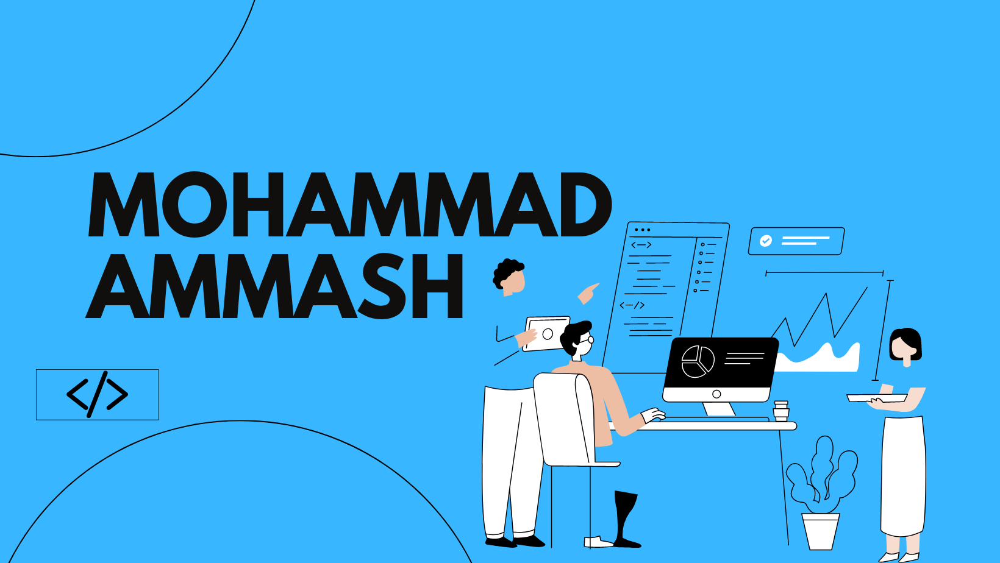

<h2 align='center'>To know is to know that you know nothing :mag_right:	</h2>

- :notes: 2023 Learned Stacks: FastAPI, Docker, GraphQL.

- 🔭 I’m currently working on: <a href="../../../virtual_romantic_partner">Virtual-Romantic-Partner Project</a> ("frontend" Flutter Branch)

- 💬 Ask me about anything, if I don't know then I will get back to you with my research results

- ⚡ Fun fact **I am a big fan of hot drinks, short walks, and meeting people**
--------
<h3 align="left">Connect with me:</h3>

--------
## Proficient With:
<h3 align="left">Languages: </h3>
<table>
  <tr>
    <td align="center" height="130" width="130">
      
       <strong>Python</strong>
    </td>
    <td align="center" height="130" width="130">
      
       <strong>JavaScript</strong>
    </td>
    <td align="center" height="130" width="130">
      
       <strong>TypeScript</strong>
    </td>
    <td align="center" height="130" width="130">
      
       <strong>Dart</strong>
    </td>
    </td>
     <td align="center" height="130" width="130">
      
       <strong>PHP</strong>
    </td>
  <td align="center" height="130" width="130">
      
       <strong>MySQL</strong>
    </td>
    <td align="center" height="130" width="130">
      
       <strong>MongoDB</strong>
    </td>
  </td>
  </tr>
</table>
<h3 align="left">Frameworks and Libraries: </h3>
<table>
 <tr>
    <td align="center" height="130" width="130">
      
       <strong>React</strong>
    </td>
    <td align="center" height="130" width="130">
      
       <strong>React Native</strong>
    </td> 
   <td align="center" height="130" width="130">
      
       <strong>ExpressJS</strong>
    </td>
   <td align="center" height="130" width="130">
      
       <strong>Laravel</strong>
      </td>
    <td align="center" height="130" width="130">
      
       <strong>Tailwindcss</strong>
    </td>
    <td align="center" height="130" width="130">
      
       <strong>Bootstrap</strong>
    </td>
  </tr>
</table>
<h3 align="left">Tools: </h3>
<table>
    <tr>
    <td align="center" height="130" width="130">
      
       <strong>Postman</strong>
    </td>
    <td align="center" height="130" width="130">
      
       <strong>Figma</strong>
    </td>
     <td align="center" height="130" width="130">
      
       <strong>Firebase</strong>
    </td>
  </tr>
</table>

--------
## Familiar With:
<table>
  <tr>
    <td align="center" height="130" width="130">
      
       <strong>C++</strong>
    </td>
    <td align="center" height="130" width="130">
      
       <strong>Dart</strong>
    </td>
        <td align="center" height="130" width="130">
      
       <strong>Flutter</strong>
    </td>
   <td align="center" height="130" width="130">
      
       <strong>FastAPI</strong>
   </td>
    <td align="center" height="130" width="130">
      
       <strong>GraphQL</strong>
    </td>
     <td align="center" height="130" width="130">
      
       <strong>Docker</strong>
    </td>  
  </tr>
</table>

--------
<h2>Github Statistics:</h2>

